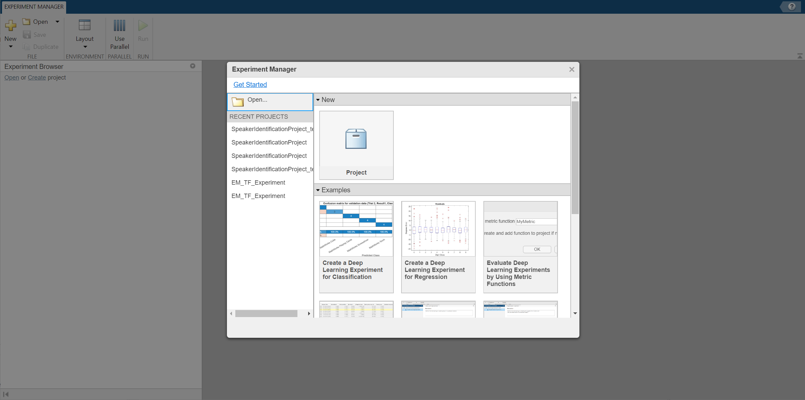
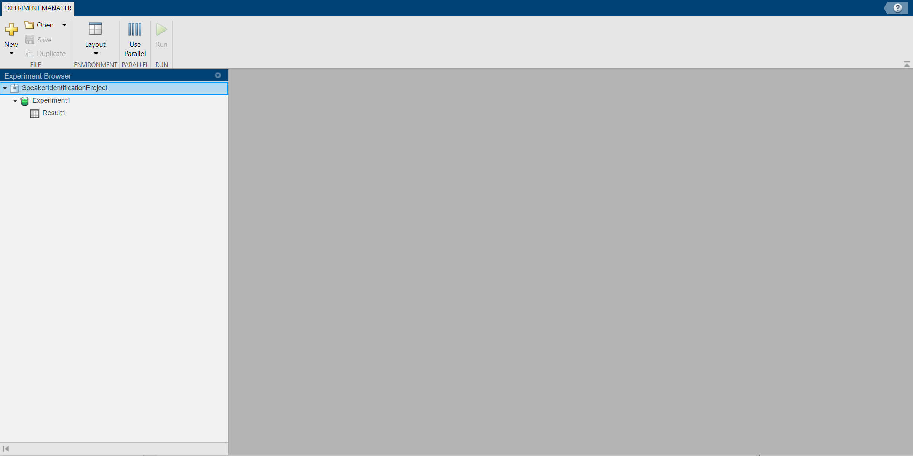
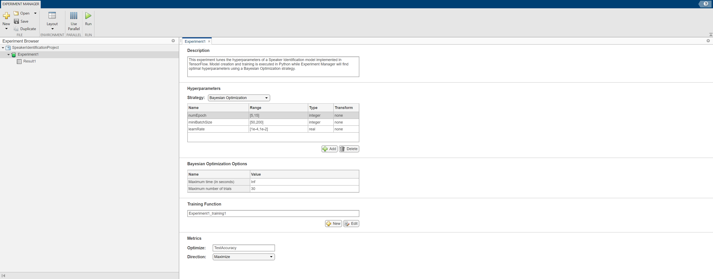
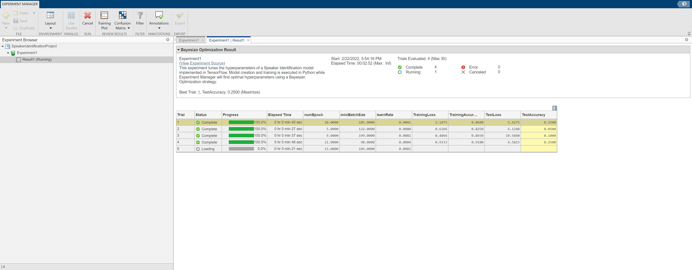

# Hyperparameter Tuning in MATLAB using Experiment Manager & TensorFlow


## This example shows how to:
* Preprocess audio data in MATLAB&reg; using the [Audio Toolbox](https://www.mathworks.com/products/audio.html)
* Train a TensorFlow&trade; model using co-execution with Python&reg;
* Tune hyperparameters of a model from MATLAB using the [Experiment Manager App](https://www.mathworks.com/help/deeplearning/ref/experimentmanager-app.html)

## Overview

There are different options for accessing Deep Learning Models within MATLAB, including:

1. Using models created in MATLAB using [Deep Learning Toolbox](https://www.mathworks.com/products/deep-learning.html)
2. [Converting](https://www.mathworks.com/help/deeplearning/deep-learning-import-and-export.html) models from other frameworks into MATLAB
3. Co-executing models from other frameworks with MATLAB

This example provides an an overview of the third approach. For further details on co-execution, see this example: [MATLAB Calling TensorFlow for Image Classification](https://github.com/matlab-deep-learning/Image-Classification-in-MATLAB-Using-Converted-TensorFlow-Model).

## Requirements 

* [MATLAB R2021b or later](https://www.mathworks.com/products/matlab.html)
* [Deep Learning Toolbox](https://www.mathworks.com/products/deep-learning.html)
* [Statistics and Machine Learning Toolbox](https://www.mathworks.com/products/statistics.html) 
* [Audio Toolbox](https://www.mathworks.com/products/audio.html) *Required to run setup script for downloading and preprocessing data
* [Tensorflow 2-2.6](https://www.tensorflow.org/install)
* [Python 3.8+](https://www.python.org/downloads/)

## Setup

In this example, you use a subset of the LibriSpeech Data Set [1], a large set of English language audioclips sampled at 16 kHz.

To download the data set and preprocess the data, run the script [hyperparameterTuningExample](https://insidelabs-git.mathworks.com/noahsung/experiment-manager-coexecution/-/blob/master/hyperparameterTuningExample.m). 
```Matlab:Code(Display)
>> hyperparameterTuningExample
```
The script saves the preprocessed data to the files `audioTrainingData.mat` and `smallerAudioTrainingData.mat` inside the `SpeakerIdentificationProject` folder, checks that your Python environment is configured correctly, and opens Experiment Manager.

## Open the experiment

When you open Experiment Manager, a dialog box provides links to the getting started tutorials and your recent projects, as well as buttons to create a new project or open an example from the documentation.



- In the left pane, click **Open**.
- Navigate into the `SpeakerIdentificationProject` directory and select the `SpeakerIdentificationProject.prj` file.



- In the Experiment Browser, double click **Experiment1**.



The **Experiment** pane displays the description, tuning strategy, hyperparameters, and training function that define the experiment. This experiment uses Bayesian Optimization to find the hyperparameter values (number of epochs, minibatch size, and learning rate) that optimize the test accuracy.

The training function [Experiment1_training1](https://insidelabs-git.mathworks.com/noahsung/experiment-manager-coexecution/-/blob/master/SpeakerIdentificationProject/Experiment1_training1.m) specifies the training procedure used by the experiment. To view the training function in the MATLAB Editor, under **Training Function**, click **Edit**.

```
function output = Experiment1_training1(params,monitor)
```
Because the `reducedDataset` flag is set to true, the training function loads the training and test data from the `smallerAudioTrainingData.mat` file. Using this smaller data set significantly reduces training time at the expense of performance. To use the larger data set, set the `reducedDataset` flag to false.
```
    reducedDataset = true;
    if reducedDataset
        load('smallerAudioTrainingData.mat','XTrain','YTrain','XTest','YTest');
    else
        load('audioTrainingData.mat','XTrain','YTrain','XTest','YTest');
    end

```
The `Experiment1_training1` function converts the training and test data to numpy arrays and passes them, along with the trial hyperparameters and filename for the saved model, as arguments to the Python function [trainer.py](https://insidelabs-git.mathworks.com/noahsung/experiment-manager-coexecution/-/blob/master/SpeakerIdentificationProject/trainer.py).
```
    result = py.trainer.train( ...
        py.numpy.array(XTrain), ...
        py.numpy.array(YTrain), ...
        py.numpy.array(XTest), ...
        py.numpy.array(YTest), ...
        params, ...
        modelFile);
```

## Run the Experiment

To run the experiment, click the **Run** button. 

By default, the experiment runs a maximum of 30 trials. To limit the duration of the experiment, you can modify the **Bayesian Optimization Options** by reducing the maximum running time or the maximum number of trials. However, note that running fewer than 30 trials can prevent the Bayesian optimization algorithm from converging to an optimal set of hyperparameters.

A table of results displays the hyperparameter and metric function values for each trial. Experiment Manager highlights the trial with the optimal value for the selected metric.



After training is complete, Experiment Manager saves each trained model as a TensorFlow SavedModel.

## References

[1] V. Panayotov, G. Chen, D. Povey and S. Khudanpur, "Librispeech: An ASR corpus based on public domain audio books," 2015 IEEE International Conference on Acoustics, Speech and Signal Processing (ICASSP), Brisbane, QLD, 2015, pp. 5206-5210, doi: 10.1109/ICASSP.2015.7178964

Copyright 2022, The MathWorks, Inc.
